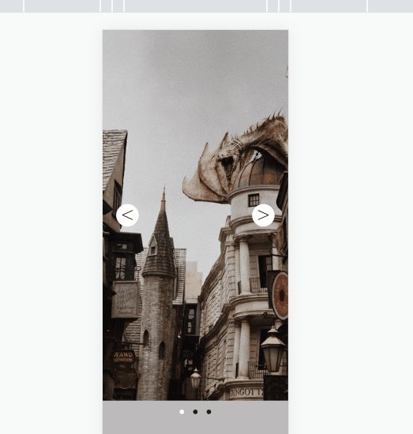

# Slider
Esse é um projeto foi desenvolvido no curso FrontStart com a intenção de praticar Overflow, Scroll e responsividade.

##  Layout

 

### Link da página
https://barbcastro.github.io/slider/

## Tecnologias Utilizadas:

 - HTML
 - CSS
 - JAVASCRIPT
